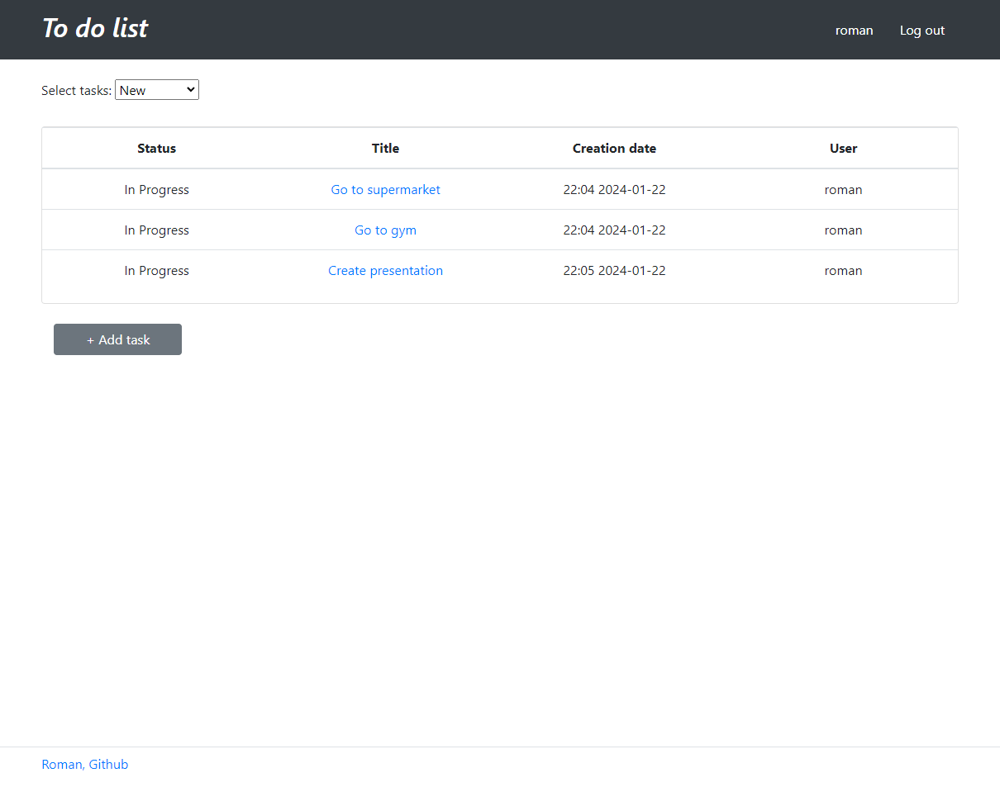
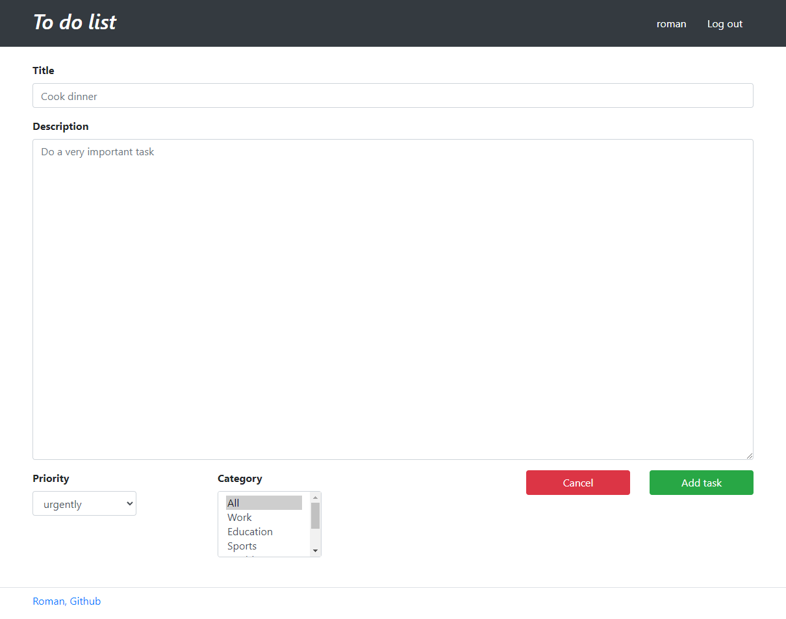
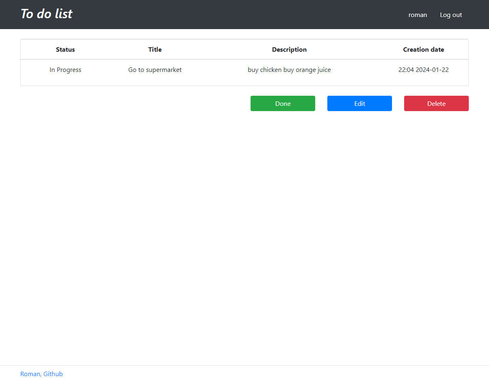
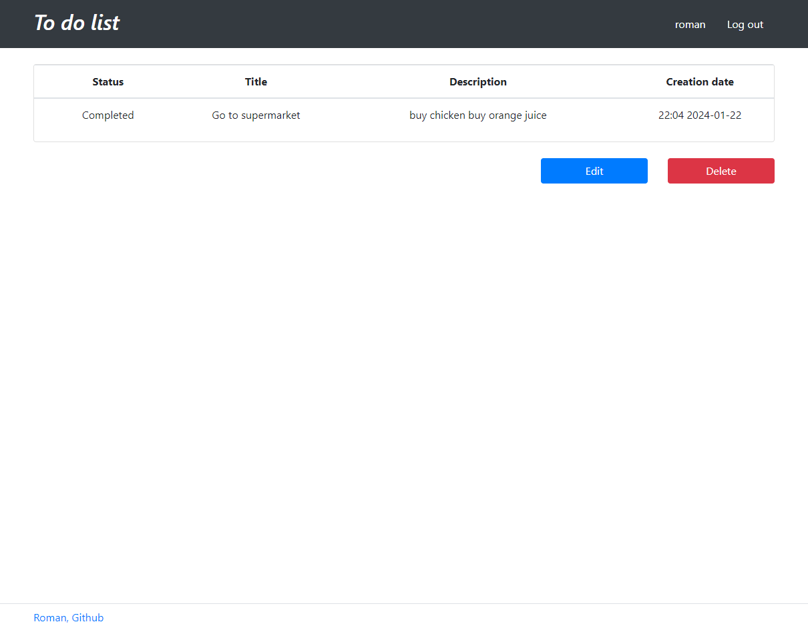
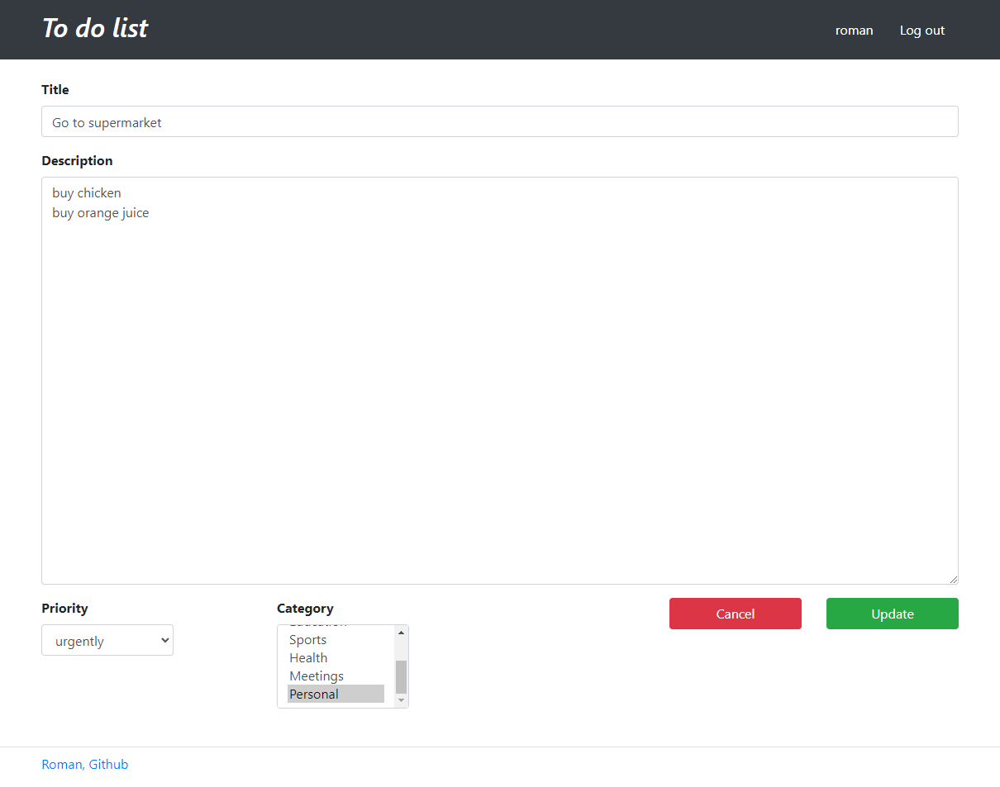
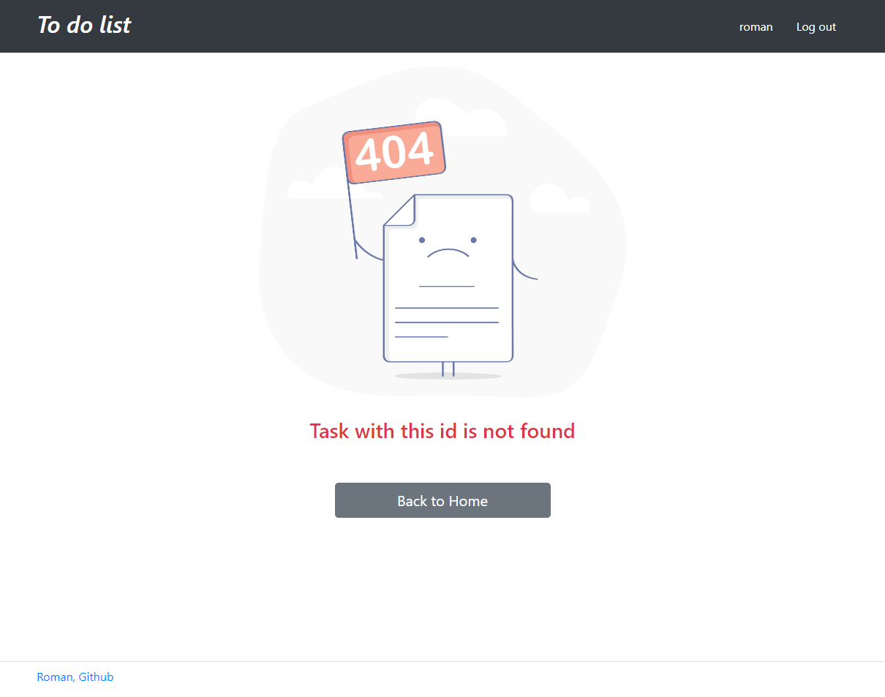

# To do list
A simple to do list app to manage your tasks

### The main logic of the App:

* Displaying all / completed / new tasks
* When you click on a task, you are taken to a page with a detailed description of the task
* Edit / update / delete task
* If you clicked on the "done" button, the task is moved to the completed state
* The "edit" button takes the user to a separate page for editing
* The "delete" button deletes the task and goes to the list of all tasks

### Used technologies:
* Java 17
* Maven 3.9.5
* PostgreSQL 16
* Spring Boot 2.7.3
* Lombok 1.18.22
* Junit 5.8.2
* AssertJ 3.22.0
* Mockito 4.5.1
* Liquibase 4.15.0
* Hibernate 5.6.11.Final
* H2database 2.1.214
* Thymeleaf 2.7.3
* Bootstrap 4.1.3
* Checkstyle 10.12.5
* JoCoCO 0.8.7

### Environment Requirements:
* JDK 17
* Maven 3.9.5
* PostgreSQL 16

### How to run the project:

- To run the project, you need to clone the project from this repository;
- Then you need to create a local database "todo";
- Specify the login and password for the database you created in the db/liquibase.properties file;
- Run liquibase to pre-create and autofill tables;
- Launch the application through the Main class, located in the folder src\main\java\ru\job4j\todo\Main;
- Open the page http://localhost:8080/index in the browser;

---

## Application screenshots

### Home page

### All tasks

### Completed tasks

### New tasks

### Add task

### Select new task

### Select done task

### Edit task

### Error page
